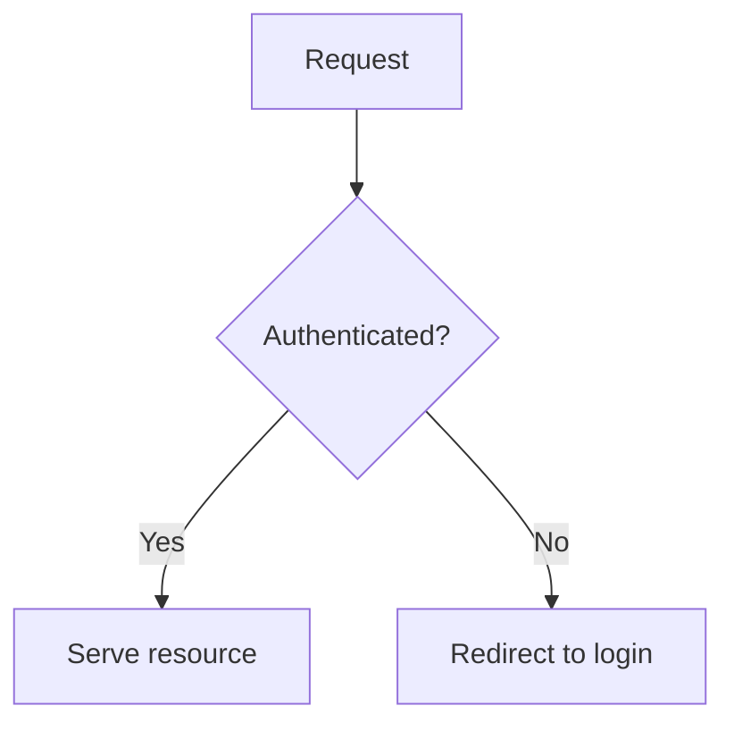

# Pull Request

Open GitHub pull requests whose description does the reviewer's homework for them. The reviewer should understand what changed, why it matters to them, and what it looks like running - without checking out the branch and building the environment themselves.

This skill assumes the branch is already committed and pushed. It does not commit or push. It covers everything from "the branch is ready" through `gh pr create` with a rich body.

Works the same for Claude Code and Codex, and the whole flow is **headless** - no GitHub browser session anywhere. Companion skills named below (`agent-browser`, `mermaid-diagrams`, `video-inspector`) are loaded through whatever mechanism your harness uses; if one isn't installed, fall back to the inline guidance here.

## Why this skill exists

A bare "did X, changed Y" PR forces the reviewer to reconstruct intent from the diff and, for anything visual or non-trivial, to pull the branch and run it before they can approve. That is the expensive step this skill removes, with two additions:

1. A **plain-language explanation** in both technical and practical terms, so a reviewer who didn't write the code understands the impact.
2. **Visual proof, when the change warrants it** - a diagram, screenshots, or a short clip - so the reviewer sees the new behaviour instead of imagining it.

Not every PR needs visuals; applying them to a one-line config change is noise. Knowing *when* to add them is the core skill - see the decision guide.

## How media gets into the PR (the mechanism)

Two facts make this fully headless:

- **Any public image URL renders inline** on GitHub via ``. So screenshots just need a host.
- A recording is turned into an **animated GIF or WebP** (ffmpeg). That makes it an *image*, so it renders inline and autoplays from any host - sidestepping GitHub's rule that only its own `user-attachments` render as a `<video>` player. No browser upload, no drag-drop.

The host is **GitHub release assets**: media is uploaded to a dedicated prerelease tag with the `gh` CLI (already authenticated), and the returned `.../releases/download/...` URL is embedded in the body. On a private repo those URLs stay behind GitHub auth, so internal UI screenshots aren't exposed to the public. Mermaid needs no host at all - GitHub renders it from a fenced block.

## Dependencies (don't assume they're installed)

This skill runs across different machines and CI, so check for tools before using them rather than assuming - and never silently install. What each path needs:

- **`gh` (authenticated)** - required to open the PR and host assets. Needed by every PR. The bundled scripts check for it and print install + `gh auth login` guidance if it's missing.
- **`ffmpeg`** - required *only* when converting a recording to a GIF/WebP. Text-only, Mermaid-only, and screenshot-only PRs don't need it. `scripts/webm-to-gif.sh` checks for ffmpeg first and, if absent, prints per-OS install instructions and exits without installing.
- **`agent-browser`** - required only when capturing screenshots or recordings.

When a required tool is missing, surface the printed guidance to the user and **ask permission before installing** (e.g. `brew install ffmpeg` on macOS, `sudo apt-get install -y ffmpeg` on Debian/Ubuntu, `winget install Gyan.FFmpeg` on Windows). If the user declines or you can't install, degrade gracefully: drop the visual that needed it (a recording becomes before/after screenshots, or a plain link to the clip) rather than blocking the PR.

## Workflow

### 1. Understand the change

Read the actual diff before writing anything. Determine the base branch (usually `main`), then:

```bash
git rev-parse --abbrev-ref HEAD          # confirm you're not on the base branch
git log --oneline <base>..HEAD           # commits that will be in the PR
git diff --stat <base>...HEAD            # scope: which files, how much
git diff <base>...HEAD                   # the substance
```

As you read, classify the change - this drives which visuals (if any) are worth producing:

- **Logic / control flow / algorithm / state machine / data pipeline** changed → a Mermaid diagram of the new (or before→after) flow usually pays off.
- **UI / UX / frontend / rendered output** changed → before/after screenshots usually pay off.
- **Complex, multi-step, or interactive** behaviour (a new flow, a wizard, a drag interaction - hard to convey in stills) → a short screen recording usually pays off.
- **Trivial** (docs, config, dependency bump, small internal refactor with no behaviour change) → skip visuals. Keep the body short; the plain-language section can be a sentence or two.

A single PR can hit several. Use judgement, not a checklist - the test is always "does this help the reviewer approve faster," never "did I include one of each."

### 2. Draft the plain-language explanation (always)

Every PR gets this, regardless of type. Write two short paragraphs:

- **In technical terms:** the mechanism - what the change does under the hood, which files/systems it touches, the behaviour that's now different. For someone who knows the codebase but didn't write this change.
- **What this means in practice:** the impact for the person on the other end - user, operator, next developer. What can they now do, or what stops going wrong, that they couldn't before? Plain language, no jargon.

### 3. Produce the visuals that are warranted

Only the ones step 1 flagged.

**Mermaid diagrams (logic/flow).** Embed directly as a ```` ```mermaid ```` fenced block - GitHub renders it natively, nothing to host. If the `mermaid-diagrams` skill is available, load it first; it catches syntax errors that only surface at render time. Prefer a small, readable diagram of the flow that changed; if the logic was *replaced*, a before/after pair communicates it better than one.

**Screenshots (UI/UX).** Use the `agent-browser` skill to drive the app locally and capture them - this only automates *your* app, so no GitHub login is involved. Load its usage guide for version-current commands:

```bash
agent-browser skills get core            # screenshots + video recording workflows
```

Capture **before and after** the same screen at the same viewport when feasible - the contrast is what makes the change legible. After-only is fine for a net-new screen. Save into `.pr-media/` (next step) with descriptive names (`login-before.png`, `login-after.png`).

**Recordings (complex changes).** Record the one flow the PR changes with agent-browser (`record start/stop`, WebM out) - keep it short and purposeful, not a tour. Optionally load the `video-inspector` skill afterward to confirm the clip caught the intended moments. Then convert it to a compact inline asset:

```bash
bash <this-skill>/scripts/webm-to-gif.sh .pr-media/checkout-flow.webm .pr-media/checkout-flow.webp
```

WebP is smaller; pass a `.gif` output name instead for maximum compatibility. The script wraps the ffmpeg palette/scale flags so you don't hand-tune them. If ffmpeg isn't installed it prints per-OS install instructions and exits (code 3) without installing - surface that to the user and ask before installing; if they decline, fall back to before/after screenshots or embed the raw clip as a link instead of blocking the PR.

### 4. Stage media locally - and keep it out of git

Screenshots and recordings are binaries that must never be committed. Stage them in `.pr-media/` and gitignore it **before** writing any files:

```bash
grep -qxF '.pr-media/' .gitignore 2>/dev/null || echo '.pr-media/' >> .gitignore
mkdir -p .pr-media
```

Because media is served from GitHub release assets (next step), it never needs to live in the repo history - `.pr-media/` is scratch space, and gitignoring it is the safety net against a stray `git add -A`.

### 5. Publish image/GIF assets and get their URLs

Mermaid is already inline and needs nothing here. For every screenshot and converted clip, upload and collect the embeddable URL:

```bash
bash <this-skill>/scripts/publish-pr-media.sh .pr-media/login-before.png .pr-media/login-after.png
# prints one https://github.com/<owner>/<repo>/releases/download/pr-assets/<branch>__<file> per input
```

The script creates a dedicated `pr-assets` prerelease once (if missing), uploads each file namespaced by branch (so PRs don't collide), and prints the inline-ready URL. Re-running clobbers the same asset name, so it's safe to iterate. If you'd rather run it by hand, the equivalent is `gh release create pr-assets --prerelease` (once) then `gh release upload pr-assets <file> --clobber`, with the URL built as `https://github.com/$(gh repo view --json nameWithOwner -q .nameWithOwner)/releases/download/pr-assets/<file>`.

### 6. Assemble the PR body

Use this structure. Sections that don't apply are omitted, not left empty. Write it to a file (`.pr-media/pr-body.md`) so the next step can use `--body-file` - that avoids shell-escaping a long body full of backticks and pipes.

````markdown
## Summary

<What was done, in a few bullets. The conventional "what changed" list.>

## What changed and why it matters

**In technical terms:** <mechanism, files/systems touched, behaviour now different>

**What this means in practice:** <impact for the user/operator/next dev, in plain language>

## Visual walkthrough

<Only when warranted. One or more of:>



| Before | After |
| --- | --- |
|  |  |

   <!-- the converted recording, autoplays inline -->

## How to verify (optional)

<Steps a reviewer can run locally, or what to look at.>

## Notes / risks (optional)

<Trade-offs, follow-ups, things deliberately out of scope.>
````

Keep it proportional: a trivial PR is just **Summary** + a two-line **What changed and why it matters**; a large UX change earns the full treatment. Match the repo's existing PR conventions if it has any (`gh pr view <n>` on a recent merged PR). Plain hyphens, never em/en dashes. No filler openers or closers.

### 7. Create the PR

```bash
gh pr create --base <base> --title "<title>" --body-file .pr-media/pr-body.md
```

Then confirm it rendered: `gh pr view --web` (or fetch the body) and check the diagram, images, and clip all display. If an image 404s, the asset name in the URL doesn't match what was uploaded - re-check step 5's output.

If `gh` release upload is unavailable in the environment, fall back gracefully: leave the media in `.pr-media/`, write the body with a short note listing which files map to which spot, and tell the user the exact paths so they can attach them manually.

## Quick reference

| Change type | Visual | Host |
| --- | --- | --- |
| Logic / flow / algorithm | Mermaid diagram (before→after if replaced) | Inline, none needed |
| UI / UX / frontend | Before/after screenshots | GitHub release asset |
| Complex / interactive | Short recording → GIF/WebP | GitHub release asset |
| Trivial (docs/config/refactor) | None | - |

Every PR gets **Summary** and **What changed and why it matters**. Visuals are additive and conditional. Media never enters git history - it's staged in gitignored `.pr-media/` and served from release assets.

## Bundled scripts

Both live in this skill's own directory - `~/.claude/skills/pull-request/scripts/` under Claude Code, `~/.agents/skills/pull-request/scripts/` under Codex. Invoke by that path (the `<this-skill>` in the examples above stands for the skill's directory).

- `scripts/publish-pr-media.sh <file>...` - ensure the `pr-assets` prerelease exists, upload each file (namespaced by branch), print inline-ready URLs. Checks for authenticated `gh` and prints install/auth guidance if missing.
- `scripts/webm-to-gif.sh <input.webm> [output.gif|.webp]` - convert a recording to a compact animated asset. Checks for ffmpeg and prints per-OS install guidance if missing. Env: `FPS` (default 12), `WIDTH` (default 960).
