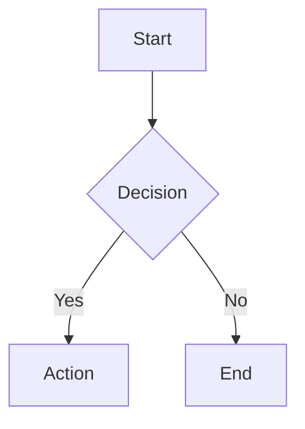
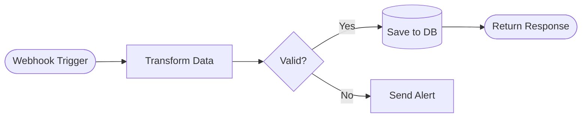

# Mermaid Diagrams

Generate syntactically correct Mermaid diagrams for Markdown. Natively supported by GitHub, GitLab, Notion, Obsidian, and more.

## Output Format

Always wrap Mermaid code in a fenced code block with the `mermaid` language identifier:

````markdown

````

## Choosing a Diagram Type

| Need                            | Diagram Type  | Declaration         |
| ------------------------------- | ------------- | ------------------- |
| Process/workflow/logic          | Flowchart     | `flowchart TD`      |
| API calls, service interactions | Sequence      | `sequenceDiagram`   |
| Object lifecycle                | State         | `stateDiagram-v2`   |
| UX/process satisfaction scoring | User Journey  | `journey`           |
| Project schedule/timeline       | Gantt         | `gantt`             |
| Brainstorming/hierarchy         | Mindmap       | `mindmap`           |
| Proportions/distribution        | Pie Chart     | `pie`               |
| Database schema                 | ER Diagram    | `erDiagram`         |
| OOP structure                   | Class Diagram | `classDiagram`      |
| Git history                     | GitGraph      | `gitGraph`          |
| Chronological events            | Timeline      | `timeline`          |
| Task board                      | Kanban        | `kanban`            |
| System components               | Architecture  | `architecture-beta` |
| Block layout                    | Block Diagram | `block-beta`        |

**Default to `flowchart`** when the diagram type is ambiguous.

## Flowchart Syntax (Primary)

### Declaration & Direction

```text
flowchart <DIRECTION>
```

Directions: `TD` (top-down), `TB` (top-bottom, same as TD), `LR` (left-right), `RL` (right-left), `BT` (bottom-top).

Use `LR` for wide workflows (e.g. n8n/Windmill pipelines). Use `TD` for decision trees and vertical processes.

### Keep diagrams narrow enough to render legibly

Renderers (GitHub, Notion, Obsidian, PDF previewers) auto-fit the entire diagram to the container width. The more nodes you place along the dominant axis, the more each node shrinks - past a certain point the labels become unreadable.

Hard rules:

- **Max 6 nodes along the dominant axis** (left-to-right for `LR`, top-to-bottom for `TD`). Count the longest straight path; branches don't add to the count.
- If a single chain would exceed 6 nodes, **break it up**:
  - Switch direction (`LR` -> `TD`) so the long axis is vertical, which scrolls instead of shrinking.
  - **Split into multiple diagrams** with a heading per phase ("Intake", "Processing", "Dispatch"). Two short diagrams beat one squashed one.
  - **Collapse adjacent rectangles** that don't carry independent meaning into a single node (e.g. "Pull data + render template" instead of two boxes).
  - Use **subgraphs** to group steps; the subgraph counts as one node along the parent axis.
- Avoid putting decision diamonds and their downstream branches all on the same horizontal row - the branches push the whole diagram wider. Prefer `TD` when a flow has 2+ decision points.
- Keep node labels short (ideally <= 4 words, one `<br/>` if needed). Long labels widen every node in the row because Mermaid sizes columns to the widest member.

### Node Shapes

```mermaid
A                     %% rectangle (default)
B[Text]               %% rectangle with text
C(Rounded)            %% rounded rectangle
D([Stadium])          %% stadium/pill shape
E[[Subroutine]]       %% subroutine
F[(Database)]         %% cylinder
G((Circle))           %% circle
H{Diamond}            %% decision/diamond
I{{Hexagon}}          %% hexagon/prepare
J[/Parallelogram/]    %% input/output
K[\Parallelogram alt\]
L[/Trapezoid\]        %% trapezoid
M[\Trapezoid alt/]
```

**v11.3.0+ expanded shape syntax** (use when semantic meaning matters):

```mermaid
N@{ shape: doc, label: "Document" }
O@{ shape: cyl, label: "Database" }
P@{ shape: diam, label: "Decision" }
Q@{ shape: st-rect, label: "Multi-Process" }
R@{ shape: docs, label: "Multi-Document" }
S@{ shape: flag, label: "Paper Tape" }
```

### Edges (Links)

```mermaid
A --> B                %% arrow
A --- B                %% line (no arrow)
A -.- B                %% dotted line
A -.-> B               %% dotted arrow
A ==> B                %% thick arrow
A === B                %% thick line
A --> |label| B        %% arrow with label
A -- label --> B       %% alternate label syntax
A -.->|label| B        %% dotted arrow with label
A <--> B               %% bidirectional
```

**Increase edge length** by adding extra dashes/dots/equals: `A ---> B` spans 2 ranks, `A ----> B` spans 3.

### Subgraphs

```mermaid
subgraph title [Display Name]
    direction LR
    A --> B
end
```

Subgraphs can be nested and linked to/from: `subgraphId --> NodeId`.

### Styling

```mermaid
%% Inline style
style A fill:#f9f,stroke:#333,stroke-width:2px

%% Class definition + assignment
classDef highlight fill:#f96,stroke:#333,color:#fff
class A,B highlight

%% Shorthand class assignment
A:::highlight --> B

%% Default class (applies to all unstyled nodes)
classDef default fill:#fff,stroke:#333

%% Link styling (by zero-based order of definition)
linkStyle 0 stroke:#ff3,stroke-width:2px
linkStyle default stroke:#999
```

### Comments

```mermaid
%% This is a comment
```

### Quote Labels Containing Punctuation

When a node label contains anything beyond letters, digits, spaces, commas, dots, hyphens, or `<br/>`, wrap the label in quotes. Unquoted punctuation trips the Mermaid lexer at render time, often with parser errors that point a few characters past the real cause.

Always quote labels containing: `(`, `)`, `%`, `&`, `#`, `:`, `;`, `+`, `=`, `/`, `\`, `?`, `!`, `@`, `*`, or `"`.

Stadium nodes (`([...])`) are the most common offenders because their delimiters already contain parens, so an unquoted `(` inside the label ends the node early.

```text
%% Broken: unquoted parens inside the stadium label
review([Human review (no draft created)]):::review

%% Fixed
review(["Human review (no draft created)"]):::review

%% Broken: % triggers the comment lexer
full([Every line at 100%]):::ok

%% Fixed
full(["Every line at 100%"]):::ok
```

Rule of thumb: when in doubt, quote.

### Common Gotchas

1. **"end" keyword**: Never use lowercase `end` as node text, it terminates subgraphs. Use `End`, `END`, or wrap in quotes: `A["end"]`.
2. **"o" or "x" as first letter** after `---`: Add a space or capitalise to avoid circle/cross edge syntax. `A--- oB` not `A---oB`.
3. **Entity codes**: Use `#quot;` for `"`, `#amp;` for `&`, `#35;` for `#` inside node text.
4. **Markdown in nodes**: Use `` "` `` and `` `" `` as delimiters inside node brackets: ``A["`**bold**`"]``.
5. **No return statements in click callbacks**: Click events require `securityLevel='loose'`.
6. **Line breaks in node labels**: Use `<br/>` not `\n`. The `\n` escape is inconsistently supported across renderers (e.g. VS Code Mermaid extension shows literal `\n`). `<br/>` works universally.

## Best Practices

1. **Use descriptive node IDs**: `webhookTrigger` not `A`. Aids readability in source.
2. **Keep diagrams focused**: One concept per diagram. Split complex systems into multiple diagrams.
3. **Label all decision edges**: Always label Yes/No or condition paths from diamond nodes.
4. **Consistent direction**: Don't mix directions unless using subgraphs with explicit `direction`.
5. **Group related nodes**: Use subgraphs to visually cluster related steps.
6. **Test rendering**: Validate at https://mermaid.live before committing.
7. **Line length**: Keep lines under 80 chars where possible for readability in source.

## Workflow Automation Diagrams (n8n / Windmill)

When documenting automation workflows:

- Use `LR` direction to mirror the left-to-right flow of visual workflow builders.
- Use `([Stadium])` shapes for triggers and `[(Database)]` for data stores.
- Use subgraphs to group error handling branches or parallel paths.
- Label edges with data transformations or conditions.

Example pattern:



## Reference Files

For detailed syntax on other diagram types, read the appropriate reference:

- **`references/sequence-diagrams.md`** — Sequence diagram syntax: participants, messages, activations, loops, alt/par/critical blocks, notes, actor creation/destruction.
- **`references/other-diagrams.md`** — Syntax for: state diagrams, user journey, gantt, mindmap, pie, ER, class, gitgraph, timeline, kanban, and architecture diagrams.

Read these references when the user requests a non-flowchart diagram type.
