# Other Diagram Types Reference

## Table of Contents

1. [State Diagram](#state-diagram)
2. [User Journey](#user-journey)
3. [Gantt Chart](#gantt-chart)
4. [Mindmap](#mindmap)
5. [Pie Chart](#pie-chart)
6. [ER Diagram](#er-diagram)
7. [Class Diagram](#class-diagram)
8. [GitGraph](#gitgraph)
9. [Timeline](#timeline)
10. [Kanban](#kanban)
11. [Architecture](#architecture)
12. [Block Diagram](#block-diagram)

---

## State Diagram

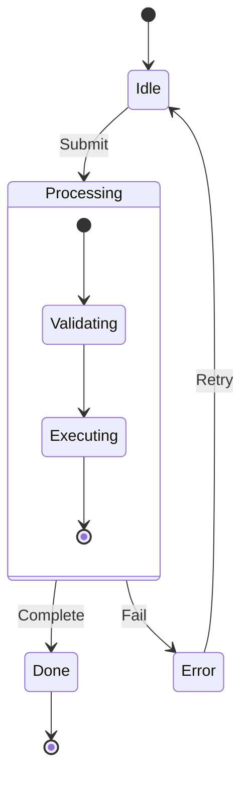

Key syntax:

- `[*]` = start/end pseudo-state
- `state Name { }` = composite/nested states
- `<<fork>>` and `<<join>>` for parallel states
- `<<choice>>` for choice pseudo-state
- Notes: `note right of State: Text`
- Direction: `direction LR` inside state blocks

---

## User Journey

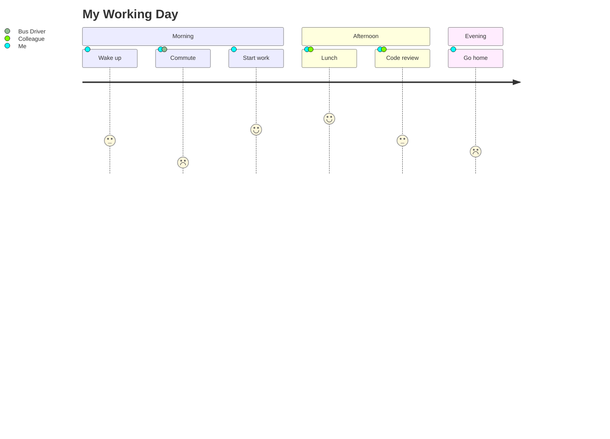

Key syntax:

- `title` sets the diagram title
- `section Name` groups tasks
- Task format: `Task name: score: actor1, actor2`
- Score: 1 (negative) to 5 (positive)

---

## Gantt Chart

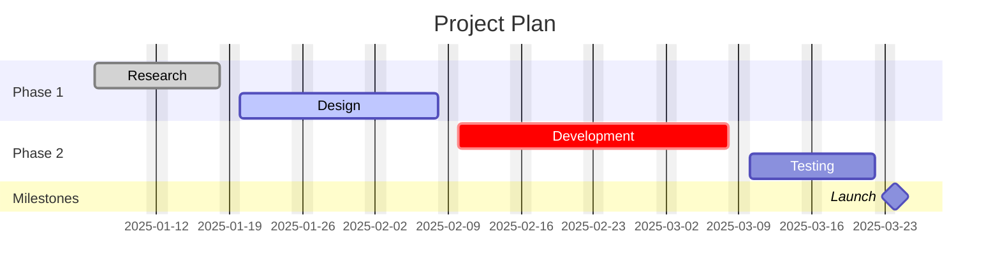

Key syntax:

- `dateFormat` sets input format (default `YYYY-MM-DD`)
- `axisFormat` sets display format (e.g. `%Y-%m-%d`)
- Tags: `done`, `active`, `crit`, `milestone` (applied before dates)
- Duration: `10d`, `1w`, or specific end date
- Dependencies: `after taskId`
- `excludes weekends` or specific dates
- `todayMarker off` to hide today marker
- `tickInterval 1week` to set axis ticks
- `until` keyword (v10.9.0+): task runs until another task starts

---

## Mindmap

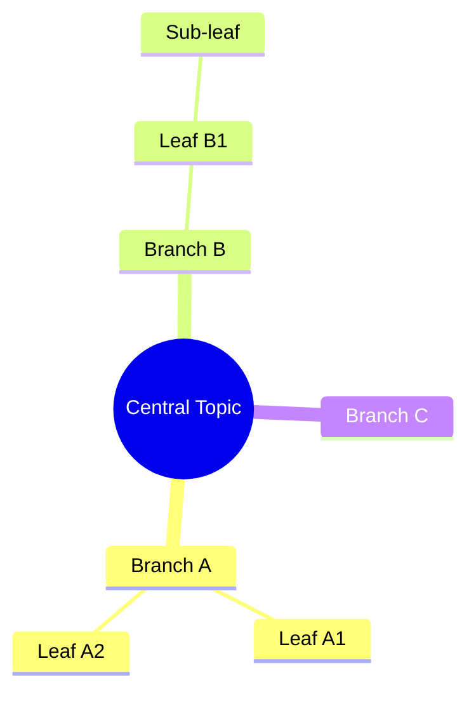

Key syntax:

- Indentation defines hierarchy (any consistent indentation works)
- Node shapes follow flowchart conventions: `(Rounded)`, `[Square]`, `((Circle))`, `))Bang((`, `{Cloud}`
- Icons: `::icon(fa fa-book)` after node text
- Classes: `:::className` after node text
- Layout option: `layout: tidy-tree` in frontmatter config

---

## Pie Chart

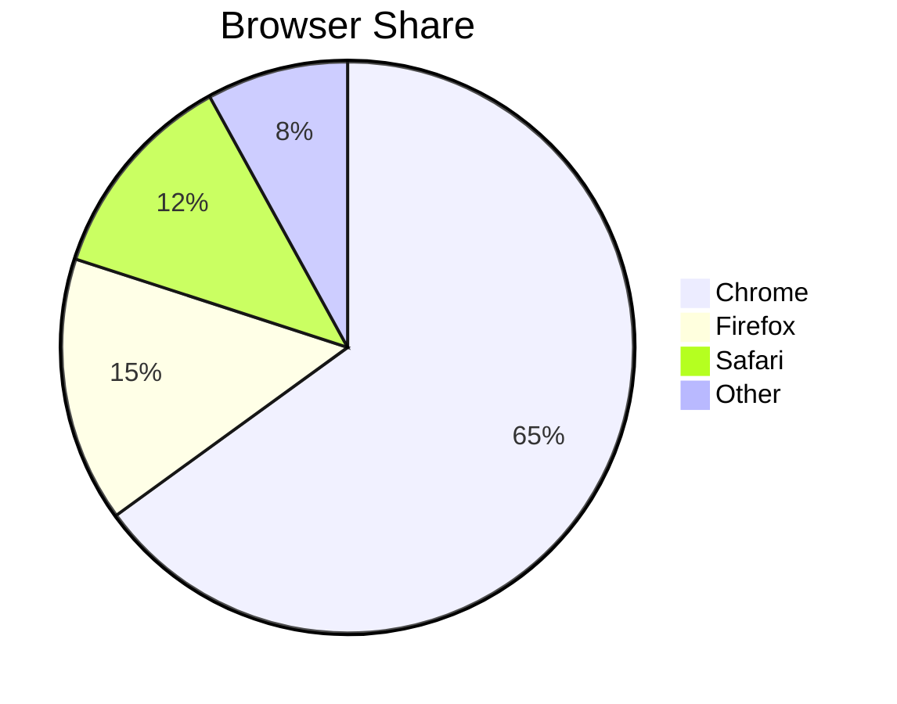

Key syntax:

- `pie showData` to display values on the chart
- Values can be raw numbers or percentages (Mermaid calculates proportions)
- `title` is optional

---

## ER Diagram

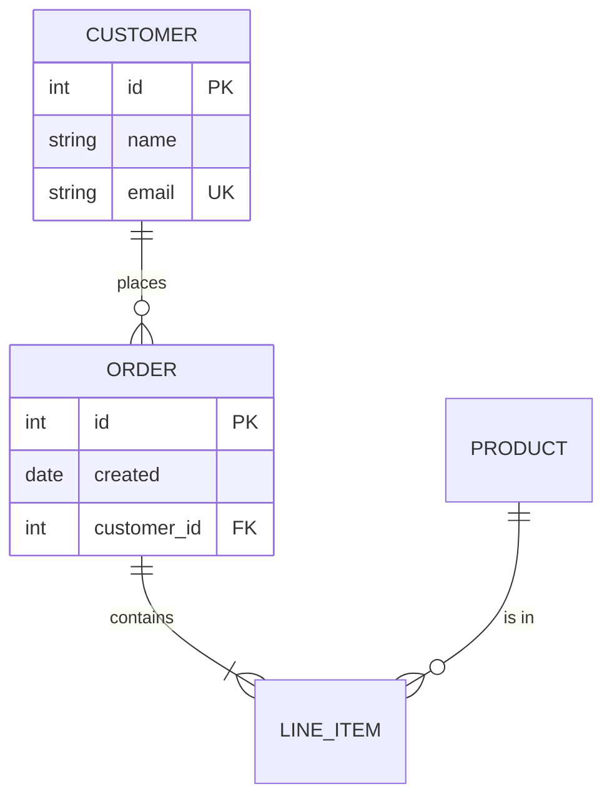

Relationship syntax:

- `||` = exactly one
- `o|` = zero or one
- `}|` = one or more
- `}o` = zero or more
- Left side `--` right side, e.g. `||--o{` = one-to-zero-or-many
- Attribute types: `type name` with optional `PK`, `FK`, `UK` constraints

---

## Class Diagram

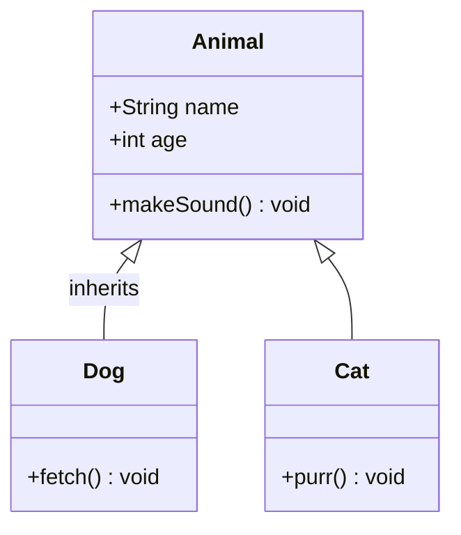

Relationships:

- `<|--` inheritance
- `*--` composition
- `o--` aggregation
- `-->` association
- `..>` dependency
- `..|>` realisation

Visibility: `+` public, `-` private, `#` protected, `~` package.

---

## GitGraph

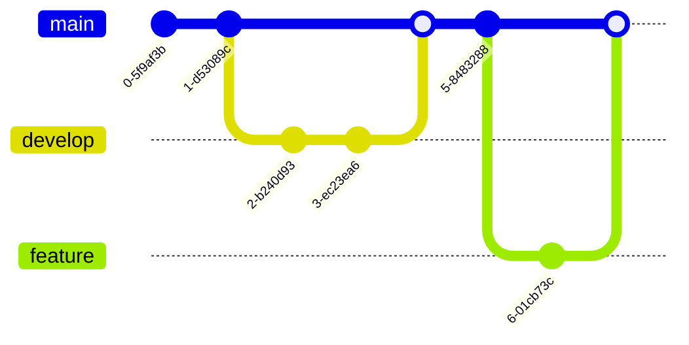

Key syntax:

- `commit id: "msg"` or `commit tag: "v1.0"`
- `commit type: HIGHLIGHT` or `REVERSE` or `NORMAL`
- `branch name`, `checkout name`, `merge name`
- `cherry-pick id: "commitId"`
- Frontmatter config: `gitGraph TB` for top-bottom orientation

---

## Timeline

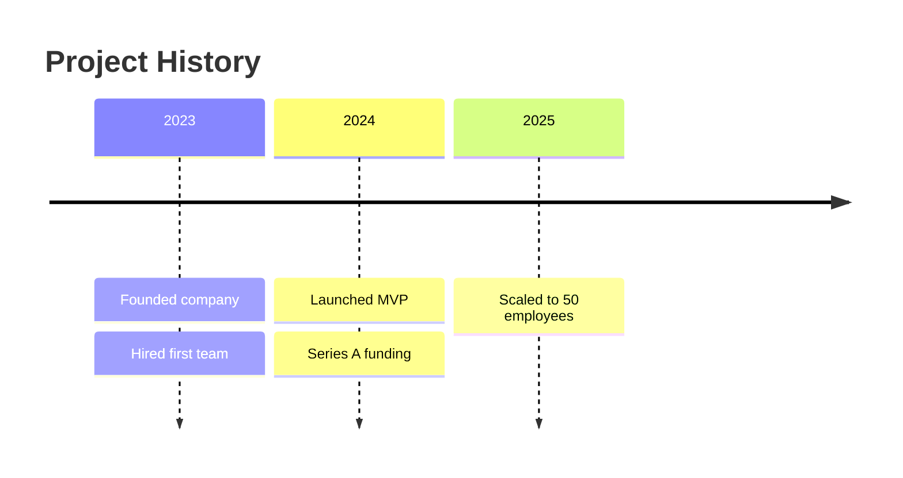

Key syntax:

- Time periods on their own line, followed by events prefixed with `:`
- Multiple events per time period on subsequent indented lines
- `section Name` to group time periods

---

## Kanban

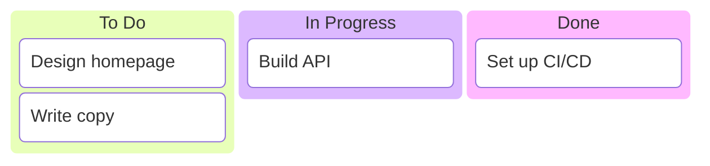

Key syntax:

- Columns defined with `columnId[Title]`
- Tasks nested under columns with `taskId[Title]`
- Metadata via `@{ priority: "high", assigned: "Rod" }` after task
- `ticketBaseUrl` in config for auto-linking ticket IDs

---

## Architecture

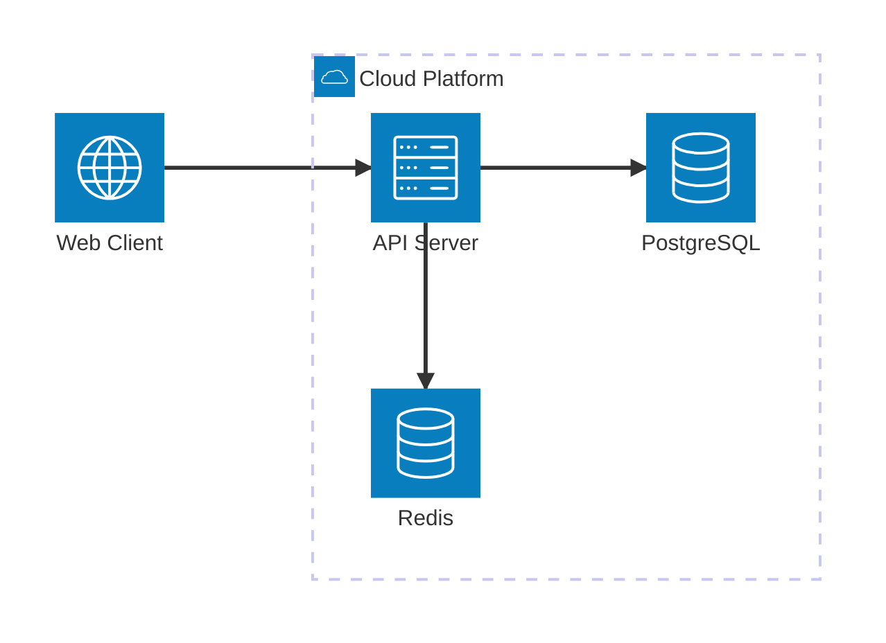

Key syntax:

- `group name(icon)[Label]` — groups with optional icon
- `service name(icon)[Label] in groupName` — services
- Connections: `service1:edge --> edge:service2`
- Edge positions: `T` (top), `B` (bottom), `L` (left), `R` (right)
- Icons: Built-in set includes `cloud`, `server`, `database`, `disk`, `internet`, `github`

---

## Block Diagram

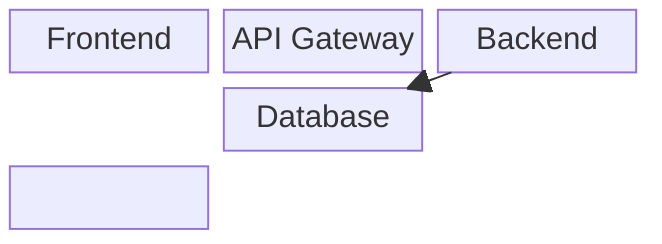

Key syntax:

- `columns N` sets grid width
- `space` creates empty cells
- Blocks span columns: `A["Wide"]:2` spans 2 columns
- Nested blocks: `block:groupName ... end`
- Shapes use flowchart conventions: `()`, `{}`, `[]`, `(())`, etc.

---

## Common Configuration (All Diagrams)

Frontmatter config block (placed before diagram declaration):

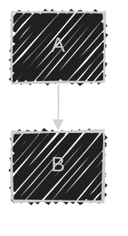

Available themes: `default`, `dark`, `forest`, `neutral`, `base`.

Look options (v11+): `classic`, `handDrawn`.

Layout engines: `dagre` (default), `elk` (better for complex diagrams).
