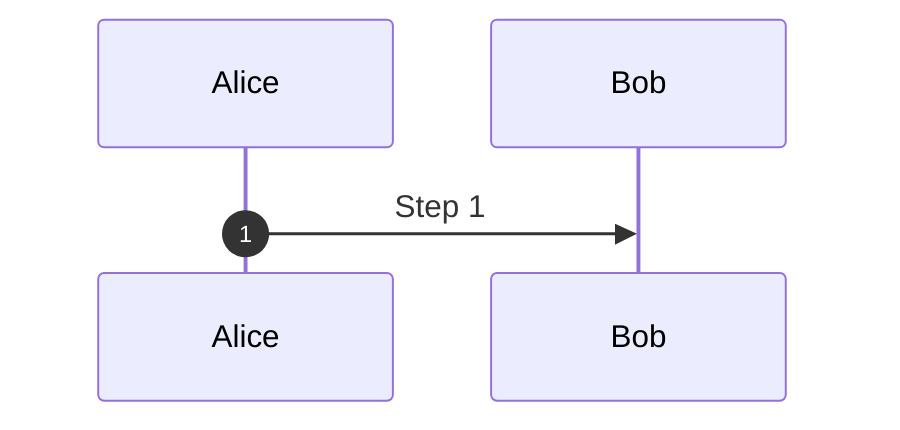

# Sequence Diagrams Reference

## Declaration

```mermaid
sequenceDiagram
```

## Participants & Actors

```mermaid
participant A as Alice        %% rectangle
actor B as Bob                %% stick figure
```

Symbols: `participant` (rectangle), `actor` (stick figure).

Additional types available via JSON config (v11+): `boundary`, `control`, `entity`, `database`, `collections`, `queue`.

### Grouping (Boxes)

```mermaid
box Aqua Group Name
    participant A
    participant B
end
```

Supports colours: `box rgb(33,66,99)`, `box rgba(33,66,99,0.5)`, `box transparent Aqua`.

## Messages (Arrows)

| Syntax | Description |
| --- | --- |
| `->` | Solid line, no arrow |
| `-->` | Dotted line, no arrow |
| `->>` | Solid line, arrowhead |
| `-->>` | Dotted line, arrowhead |
| `<<->>` | Bidirectional solid (v11.0.0+) |
| `<<-->>` | Bidirectional dotted (v11.0.0+) |
| `-x` | Solid with cross (lost message) |
| `--x` | Dotted with cross |
| `-)` | Solid with open arrow (async) |
| `--)` | Dotted with open arrow (async) |

```mermaid
Alice->>Bob: Hello
Bob-->>Alice: Hi back
```

## Activations

```mermaid
activate Alice
Alice->>Bob: Request
deactivate Alice
```

Shorthand: `Alice->>+Bob: Request` (activate), `Bob-->>-Alice: Response` (deactivate). Activations can stack.

## Notes

```mermaid
Note right of Alice: Text
Note left of Bob: Text
Note over Alice,Bob: Spanning note
```

Line breaks: use `<br/>` in note text.

## Control Flow

### Loop

```mermaid
loop Every minute
    Alice->>Bob: Ping
end
```

### Alt / Else / Opt

```mermaid
alt Condition A
    Alice->>Bob: Path A
else Condition B
    Alice->>Bob: Path B
end

opt Optional path
    Alice->>Bob: Maybe
end
```

### Parallel

```mermaid
par Action 1
    Alice->>Bob: Message 1
and Action 2
    Alice->>Charlie: Message 2
end
```

### Critical / Option

```mermaid
critical Establish connection
    Service->>DB: Connect
option Network timeout
    Service->>Service: Retry
option Auth failure
    Service->>Log: Log error
end
```

### Break

```mermaid
break When error occurs
    Service->>Client: Error response
end
```

## Background Highlighting

```mermaid
rect rgb(200, 220, 255)
    Alice->>Bob: Inside highlight
end
```

## Actor Creation & Destruction (v10.3.0+)

```mermaid
create participant C as Charlie
Alice->>C: Hello new actor
destroy C
C->>Alice: Goodbye
```

## Sequence Numbers

Enable via frontmatter:



Or inline: `autonumber` at the start of the diagram.

## Comments

```mermaid
%% This is a comment
```

## Common Gotchas

1. The word `end` in messages will break parsing — wrap in quotes, parens, or brackets.
2. Semicolons in message text: use `#59;` entity code.
3. Participant order follows source order unless explicitly declared.
