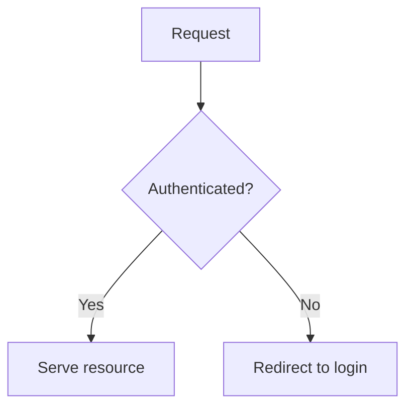

# Pull Request

Open GitHub pull requests whose description does the reviewer's homework for them. The reviewer should understand what changed, why it matters to them, and what it looks like running - without checking out the branch and building the environment themselves.

This skill assumes the branch is already committed and pushed. It does not commit or push. It covers everything from "the branch is ready" through `gh pr create` with a rich body.

Works the same for Claude Code and Codex, and the whole flow is **headless** - no GitHub browser session anywhere. It leans on companion skills where handy (`agent-browser` for capture, `mermaid-diagrams`, `video-inspector`), but none are required - each is a recommended option with a plain fallback noted inline. Load them through whatever mechanism your harness uses.

## Why this skill exists

A bare "did X, changed Y" PR forces the reviewer to reconstruct intent from the diff and, for anything visual or non-trivial, to pull the branch and run it before they can approve. That is the expensive step this skill removes, with two additions:

1. A **plain-language explanation** in both technical and practical terms, so a reviewer who didn't write the code understands the impact.
2. **Visual proof, when the change warrants it** - a diagram, screenshots, or a short clip - so the reviewer sees the new behaviour instead of imagining it.

Not every PR needs visuals; applying them to a one-line config change is noise. Knowing *when* to add them is the core skill - see the decision guide.

## How media gets into the PR

GitHub CLI uploads local images and videos directly to GitHub user attachments through the repeatable `--attach` flag. When the PR body references an attached local path, `gh` rewrites that reference in place to the uploaded URL. Attached files not referenced in the body are appended in flag order.

This keeps the workflow headless without release assets, prerelease tags, or browser uploads. Mermaid needs no upload because GitHub renders it from a fenced block.

## Dependencies

**Minimum GitHub CLI version: 2.99.0.** Check `gh --version` before using this skill. Older versions do not support `--attach`; update them before opening a PR with media.

- **`gh` 2.99.0 or later, authenticated** - required for every PR. Run `gh auth status` and ensure the account has write access to the repository. GitHub Enterprise Server does not support `--attach` as of this minimum version.
- **A browser-automation or screen-capture tool** - required only when capturing screenshots or recordings. `agent-browser` is recommended, but Playwright, Puppeteer, a native screen recorder, or OS screenshot tools also work.

If `gh` is missing or older than 2.99.0, surface the version requirement and ask permission before installing or updating it. If it cannot be updated, omit the media or give the user its local path for manual upload. Do not create release assets as a fallback.

## Workflow

### 1. Understand the change

Read the actual diff before writing anything. Determine the base branch (usually `main`), then:

```bash
git rev-parse --abbrev-ref HEAD          # confirm you're not on the base branch
git log --oneline <base>..HEAD           # commits that will be in the PR
git diff --stat <base>...HEAD            # scope: which files, how much
git diff <base>...HEAD                   # the substance
```

As you read, classify the change - this drives which visuals (if any) are worth producing:

- **Logic / control flow / algorithm / state machine / data pipeline** changed → a Mermaid diagram of the new (or before→after) flow usually pays off.
- **UI / UX / frontend / rendered output** changed → before/after screenshots usually pay off.
- **Complex, multi-step, or interactive** behaviour (a new flow, a wizard, a drag interaction - hard to convey in stills) → a short screen recording usually pays off.
- **Trivial** (docs, config, dependency bump, small internal refactor with no behaviour change) → skip visuals. Keep the body short; the plain-language section can be a sentence or two.

A single PR can hit several. Use judgement, not a checklist - the test is always "does this help the reviewer approve faster," never "did I include one of each."

### 2. Draft the plain-language explanation (always)

Every PR gets this, regardless of type. Write two short paragraphs:

- **In technical terms:** the mechanism - what the change does under the hood, which files/systems it touches, the behaviour that's now different. For someone who knows the codebase but didn't write this change.
- **What this means in practice:** the impact for the person on the other end - user, operator, next developer. What can they now do, or what stops going wrong, that they couldn't before? Plain language, no jargon.

### 3. Produce the visuals that are warranted

Only the ones step 1 flagged.

**Mermaid diagrams (logic/flow).** Embed directly as a ```` ```mermaid ```` fenced block - GitHub renders it natively, nothing to host. If the `mermaid-diagrams` skill is available, load it first; it catches syntax errors that only surface at render time. Prefer a small, readable diagram of the flow that changed; if the logic was *replaced*, a before/after pair communicates it better than one.

**Screenshots (UI/UX).** Drive the app locally and capture the changed screens with whatever browser-automation or screen-capture tool you have - this only automates *your* app, so no GitHub login is involved. The `agent-browser` skill is the recommended option (fast, works for both Claude Code and Codex); load its usage guide for version-current commands if it's available:

```bash
agent-browser skills get core            # screenshots + video recording workflows
```

Any equivalent works just as well - Playwright/Puppeteer, a headless-browser script, or an OS screenshot tool. agent-browser is a convenience, not a requirement. Capture **before and after** the same screen at the same viewport when feasible - the contrast is what makes the change legible. After-only is fine for a net-new screen. Save files in the temporary media directory from the next step with descriptive names (`login-before.png`, `login-after.png`).

**Recordings (complex changes).** Record the one flow the PR changes with any screen recorder. Keep it short and purposeful, not a tour. agent-browser (`record start/stop`, WebM out) is recommended, but any tool that emits WebM, MP4, or MOV works. Optionally load the `video-inspector` skill afterward to confirm the clip caught the intended moments. Save the original recording in the temporary media directory; `gh --attach` uploads supported videos directly and GitHub renders them as a player.

Keep upload limits in mind: images and GIFs are limited to 10 MB; videos are limited to 10 MB on GitHub Free and 100 MB on paid plans.

### 4. Stage media locally - and keep it out of git

Follow the project's instructions for temporary files and verification artifacts. Those instructions always override this default. When the project has no preference, make a best effort to stage PR media in `.pr-media/` at the repository root so the files remain associated with the project and are easy to find later. Media and temporary PR body files must not be committed.

```bash
mkdir -p .pr-media
git check-ignore -q .pr-media/ || printf '%s\n' '.pr-media/' >> "$(git rev-parse --git-path info/exclude)"
```

The repository-local exclude prevents accidental commits without changing the tracked `.gitignore`. If the project requires another location, use it instead and apply its rules. These staging instructions are best effort; never override project guidance to enforce them.

### 5. Reference media in the PR body

Use the exact local path that will be passed to `--attach`. The examples below use the default `.pr-media/`; replace it with the project-required location when applicable. `gh` rewrites image references in place and preserves their Markdown alt text:

```markdown
| Before | After |
| --- | --- |
|  |  |
```

To place a video player at a specific point, put its reference alone in a paragraph:

```markdown

```

An attached file not referenced in the body is appended at the end. Video attachments do not support alt text.

### 6. Assemble the PR body

Use this structure. Sections that do not apply are omitted, not left empty. Write it to `.pr-media/pr-body.md`, or the project-required location, so the next step can use `--body-file` without shell-escaping a long body.

````markdown
## Summary

<What was done, in a few bullets. The conventional "what changed" list.>

## What changed and why it matters

**In technical terms:** <mechanism, files/systems touched, behaviour now different>

**What this means in practice:** <impact for the user/operator/next dev, in plain language>

## Visual walkthrough

<Only when warranted. One or more of:>



| Before | After |
| --- | --- |
|  |  |


## How to verify (optional)

<Steps a reviewer can run locally, or what to look at.>

## Notes / risks (optional)

<Trade-offs, follow-ups, things deliberately out of scope.>
````

Keep it proportional: a trivial PR is just **Summary** + a two-line **What changed and why it matters**; a large UX change earns the full treatment. Match the repo's existing PR conventions if it has any (`gh pr view <n>` on a recent merged PR). Plain hyphens, never em/en dashes. No filler openers or closers.

### 7. Create the PR and upload media

Pass every referenced image and video through a separate `--attach` flag:

```bash
gh pr create \
  --base <base> \
  --title "<title>" \
  --body-file .pr-media/pr-body.md \
  --attach .pr-media/login-before.png \
  --attach .pr-media/login-after.png \
  --attach .pr-media/checkout-flow.webm
```

For an image that is not referenced in the body, alt text can follow the path after `#`, for example `--attach '.pr-media/error.png#Login error state'`. A body reference takes its alt text from the Markdown instead.

Then fetch the PR body or open `gh pr view --web` and confirm the diagram, images, and video render. If some uploads fail, `gh` can still create the PR with the successful attachments and exit non-zero. Capture the printed PR URL and inspect the created PR. To rewrite a failed local reference in place, fetch the current body to the staging directory, then pass that file and the missing attachment to `gh pr edit`. Preserve the files until the final PR body and every attachment are verified, then remove them when project instructions permit.

## Quick reference

| Change type | Visual | Delivery |
| --- | --- | --- |
| Logic / flow / algorithm | Mermaid diagram (before→after if replaced) | Fenced block in body |
| UI / UX / frontend | Before/after screenshots | `gh pr create --attach` |
| Complex / interactive | Short WebM, MP4, or MOV recording | `gh pr create --attach` |
| Trivial (docs/config/refactor) | None | - |

Every PR gets **Summary** and **What changed and why it matters**. Visuals are additive and conditional. Media never enters git history; stage it in project-local scratch space by default, or the location required by project instructions, then upload it as a GitHub user attachment.
